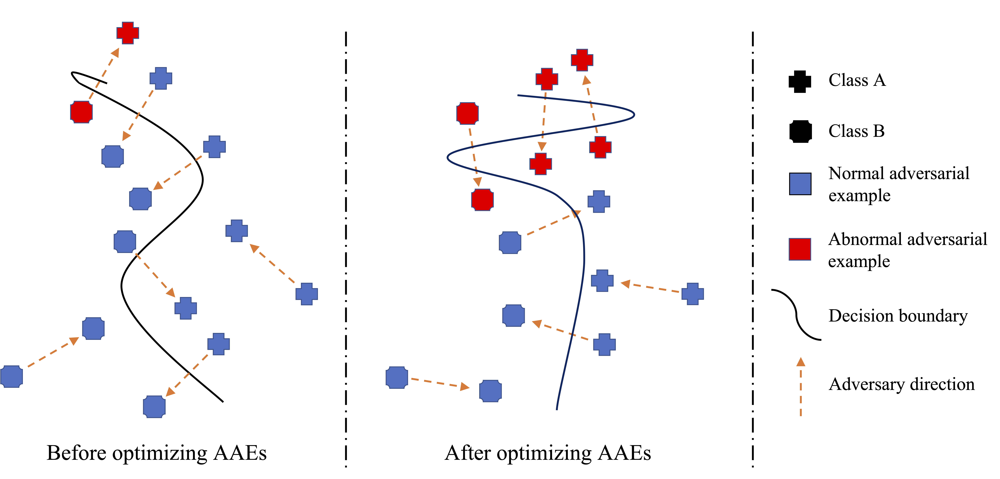

<div align="center">   

# Eliminating Catastrophic Overfitting Via Abnormal Adversarial Examples Regularization
[](https://proceedings.neurips.cc/paper_files/paper/2023/file/d65befe6b80ecf7f180b4def503d7776-Paper-Conference.pdf)

</div>

Official implementation of [Eliminating Catastrophic Overfitting Via Abnormal Adversarial Examples Regularization](https://proceedings.neurips.cc/paper_files/paper/2023/file/d65befe6b80ecf7f180b4def503d7776-Paper-Conference.pdf) (NeurIPS 2023).

## Abstract
Single-step adversarial training (SSAT) has demonstrated the potential to achieve both efficiency and robustness. However, SSAT suffers from catastrophic overfitting (CO), a phenomenon that leads to a severely distorted classifier, making it vulnerable to multi-step adversarial attacks. In this work, we observe that some adversarial examples generated on the SSAT-trained network exhibit anomalous behaviour, that is, although these training samples are generated by the inner maximization process, their associated loss decreases instead, which we named abnormal adversarial examples (AAEs). Upon further analysis, we discover a close relationship between AAEs and classifier distortion, as both the number and outputs of AAEs undergo a significant variation with the onset of CO. Given this observation, we re-examine the SSAT process and uncover that before the occurrence of CO, the classifier already displayed a slight distortion, indicated by the presence of few AAEs. Furthermore, the classifier directly optimizing these AAEs will accelerate its distortion, and correspondingly, the variation of AAEs will sharply increase as a result. In such a vicious circle, the classifier rapidly becomes highly distorted and manifests as CO within a few iterations. These observations motivate us to eliminate CO by hindering the generation of AAEs. Specifically, we design a novel method, termed $\textit{Abnormal Adversarial Examples Regularization}$ (AAER), which explicitly regularizes the variation of AAEs to hinder the classifier from becoming distorted. Extensive experiments demonstrate that our method can effectively eliminate CO and further boost adversarial robustness with negligible additional computational overhead. 

<p float="left" align="center">
 
    
**Figure.** A conceptual diagram of the classifier’s decision boundary and training samples. The training samples belonging to NAE (blue) can effectively mislead the classifier, while AAE (red) cannot. The left panel shows the decision boundary before optimizing AAEs, which only has a slight distortion. The middle panel shows the decision boundary after optimizing AAEs, which exacerbates the distortion and generates more AAEs.
</p>

## Requirements
- This codebase is written for `python3` and 'pytorch'.
- To install necessary python packages, run `pip install -r requirements.txt`.


## Experiments
### Data
- Please download and place all datasets into the data directory. 


### Training

To train AAER on CIFAR-10
```
# epsilon8
python3 AAER.py --epoch 30 --clamp 1 --alpha 1.25 --epsilon 8 --lamda1 1.0 --lamda2 2.5 --lamda3 1.5 --out-dir CIFAR10_RS-AAER_8
python3 AAER.py --epoch 30 --clamp 0 --alpha 1.00 --epsilon 8 --lamda1 1.0 --lamda2 1.5 --lamda3 0.15 --out-dir CIFAR10_N-AAER_8

# epsilon12
python3 AAER.py --epoch 30 --clamp 1 --alpha 1.25 --epsilon 12 --lamda1 1.0 --lamda2 5.0 --lamda3 2.75 --out-dir CIFAR10_RS-AAER_12
python3 AAER.py --epoch 30 --clamp 0 --alpha 1.00 --epsilon 12 --lamda1 1.0 --lamda2 5.0 --lamda3 0.55 --out-dir CIFAR10_N-AAER_12

# epsilon16
python3 AAER.py --epoch 30 --clamp 1 --alpha 1.25 --epsilon 16 --lamda1 1.0 --lamda2 7.0 --lamda3 3.25 --out-dir CIFAR10_RS-AAER_16
python3 AAER.py --epoch 30 --clamp 0 --alpha 1.00 --epsilon 16 --lamda1 1.0 --lamda2 8.5 --lamda3 1.5 --out-dir CIFAR10_N-AAER_16

# epsilon32
python3 AAER.py --epoch 30 --clamp 1 --alpha 1.25 --epsilon 32 --lamda1 1.0 --lamda2 5.75 --lamda3 1.5 --out-dir CIFAR10_RS-AAER_32
python3 AAER.py --epoch 30 --clamp 0 --alpha 1.00 --epsilon 32 --lamda1 1.0 --lamda2 2.75 --lamda3 0.75 --out-dir CIFAR10_N-AAER_32
```

To train AAER on CIFAR-100
```
# epsilon8
python3 AAER.py --epoch 30 --clamp 1 --alpha 1.25 --epsilon 8 --lamda1 1.0 --lamda2 3.5 --lamda3 1.5 --out-dir CIFAR100_RS-AAER_8
python3 AAER.py --epoch 30 --clamp 0 --alpha 1.00 --epsilon 8 --lamda1 1.0 --lamda2 1.5 --lamda3 0.15 --out-dir CIFAR100_N-AAER_8

# epsilon12
python3 AAER.py --epoch 30 --clamp 1 --alpha 1.25 --epsilon 12 --lamda1 1.0 --lamda2 3.5 --lamda3 2.75 --out-dir CIFAR100_RS-AAER_12
python3 AAER.py --epoch 30 --clamp 0 --alpha 1.00 --epsilon 12 --lamda1 1.0 --lamda2 3.5 --lamda3 0.3 --out-dir CIFAR100_N-AAER_12

# epsilon16
python3 AAER.py --epoch 30 --clamp 1 --alpha 1.25 --epsilon 16 --lamda1 1.0 --lamda2 6.0 --lamda3 2.25 --out-dir CIFAR100_RS-AAER_16
python3 AAER.py --epoch 30 --clamp 0 --alpha 1.00 --epsilon 16 --lamda1 1.0 --lamda2 6.0 --lamda3 0.5 --out-dir CIFAR100_N-AAER_16

# epsilon32
python3 AAER.py --epoch 30 --clamp 1 --alpha 1.25 --epsilon 32 --lamda1 1.0 --lamda2 5.0 --lamda3 0.75 --out-dir CIFAR100_RS-AAER_32
python3 AAER.py --epoch 30 --clamp 0 --alpha 1.00 --epsilon 32 --lamda1 1.0 --lamda2 3.5 --lamda3 0.5 --out-dir CIFAR100_N-AAER_32
```


## License and Contributing
- This README is formatted based on [paperswithcode](https://github.com/paperswithcode/releasing-research-code).
- Feel free to post issues via Github. 

## Reference
If you find the code useful in your research, please consider citing our paper:

<pre>
@article{lin2024eliminating,
  title={Eliminating Catastrophic Overfitting Via Abnormal Adversarial Examples Regularization},
  author={Lin, Runqi and Yu, Chaojian and Liu, Tongliang},
  journal={Advances in Neural Information Processing Systems},
  volume={36},
  year={2024}
}
</pre>
